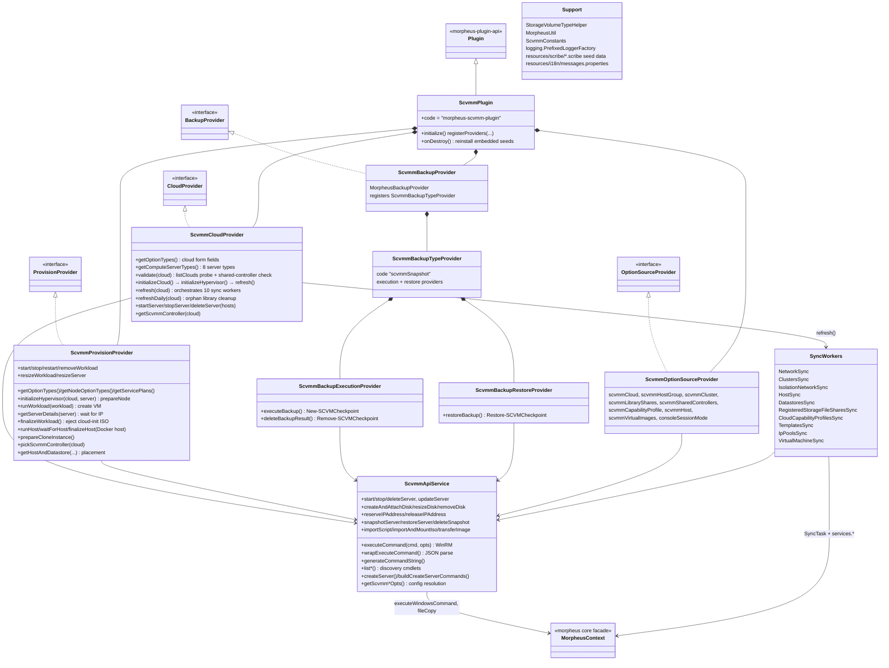
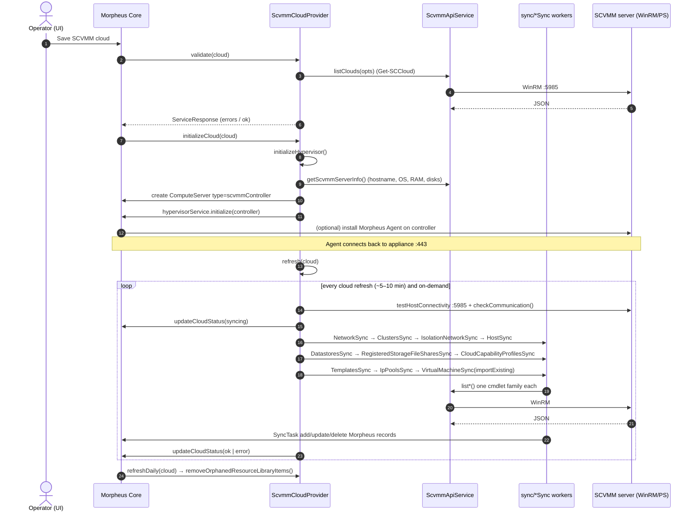
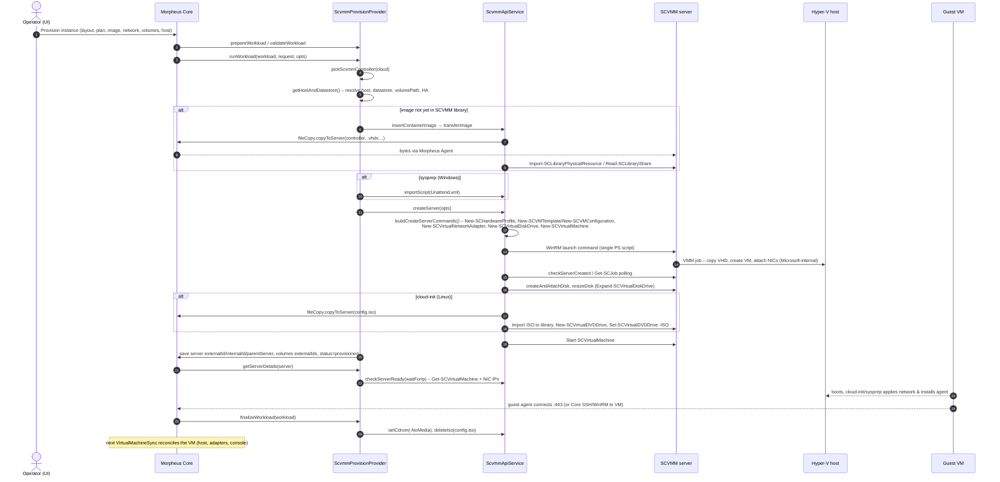
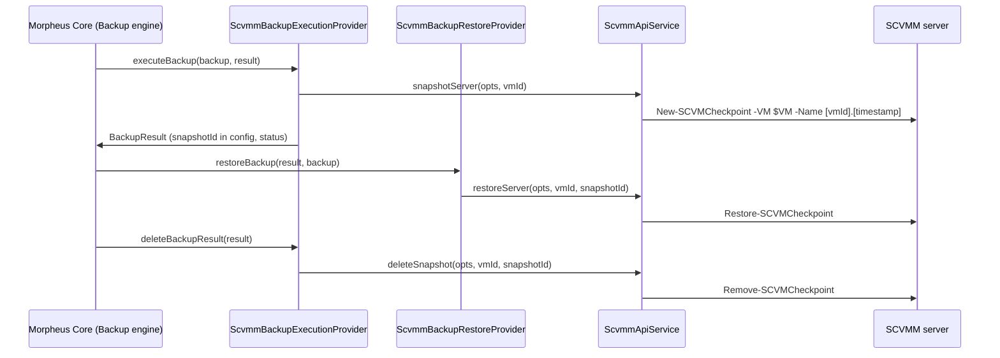
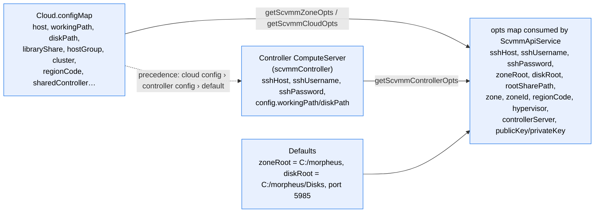

# SCVMM Plugin – Code-Level Design

This document describes how the Morpheus SCVMM plugin is built, how it plugs into the Morpheus appliance and UI, where the
system boundaries are, and which protocols cross each boundary. It is derived from the plugin source in this repository
(`src/main/groovy/com/morpheusdata/scvmm`), the [dream design page](https://github.com/HPE-EMU/dream/tree/main/docs/plugIns/scvmm),
and the internal onboarding courses (*SCVMM Morpheus Plugin Backend Developer Course*, *CloudForge Labs*).

Sections:

1. [System context and boundaries](#1-system-context-and-boundaries)
2. [Communication paths](#2-communication-paths)
3. [Plugin component design](#3-plugin-component-design)
4. [How the plugin surfaces in the Morpheus UI](#4-how-the-plugin-surfaces-in-the-morpheus-ui)
5. [Runtime flows](#5-runtime-flows)
6. [Resource mapping: SCVMM → Morpheus](#6-resource-mapping-scvmm--morpheus)
7. [Configuration resolution and the controller model](#7-configuration-resolution-and-the-controller-model)
8. [Cross-cutting concerns](#8-cross-cutting-concerns)
9. [Constraints, risks and known fault lines](#9-constraints-risks-and-known-fault-lines)

---

## 1. System context and boundaries

There are four distinct trust/runtime domains. The plugin itself lives entirely inside the Morpheus appliance JVM; it never
runs code on SCVMM or Hyper‑V directly – it only *sends PowerShell text* to the SCVMM management server and *reads JSON back*.

```mermaid
flowchart LR
    classDef boundary fill:#f7f7f7,stroke:#666,stroke-dasharray: 5 5,color:#000
    classDef plugin fill:#e8f0fe,stroke:#1a73e8,color:#000
    classDef core fill:#fff4e5,stroke:#f29900,color:#000
    classDef ms fill:#e6f4ea,stroke:#137333,color:#000
    classDef guest fill:#fce8e6,stroke:#c5221f,color:#000

    Browser["Operator browser<br/>(Morpheus UI)"]

    subgraph APPL["Boundary A – Morpheus Appliance (JVM)"]
        direction TB
        UI["Morpheus Web UI / REST API"]:::core
        CORE["Morpheus Core<br/>(Plugin Manager, MorpheusContext,<br/>scheduler, DB, agent hub, console proxy)"]:::core
        PLUGIN["<b>morpheus-scvmm-plugin.jar</b><br/>(own classloader)<br/>ScvmmPlugin → providers → ScvmmApiService"]:::plugin
        UI --> CORE
        CORE <-->|"MorpheusContext API<br/>(in-process)"| PLUGIN
    end
    class APPL boundary

    subgraph SCVMM["Boundary B – SCVMM Management Server (Windows)"]
        direction TB
        WINRM["WinRM listener<br/>:5985 / :5986"]:::ms
        AGENT["Morpheus Agent<br/>(node agent, file copy)"]:::ms
        PS["VMM PowerShell module<br/>(Get-/New-/Set-SC*)"]:::ms
        VMMSVC["VMM Service + VMM DB"]:::ms
        LIB["VMM Library Share<br/>(e.g. MSSCVMMLibrary)<br/>ISOs, VHDs, Unattend.xml"]:::ms
        WORK["Working / Disk paths<br/>(workingPath, diskPath)"]:::ms
        WINRM --> PS --> VMMSVC
        AGENT --> WORK
        WORK -.->|Import-SCLibraryPhysicalResource| LIB
    end
    class SCVMM boundary

    subgraph HV["Boundary C – Hyper-V Fabric"]
        direction TB
        HOST1["Hyper-V host / cluster node<br/>(VMM host agent, vmconnect :2179)"]:::ms
        HOST2["Hyper-V host …"]:::ms
        STORAGE["Storage volumes / CSVs /<br/>SMB file shares"]:::ms
        HOST1 --- STORAGE
        HOST2 --- STORAGE
    end
    class HV boundary

    subgraph GUEST["Boundary D – Provisioned guests"]
        VM["VM (Linux / Windows / Docker host)<br/>cloud-init or sysprep,<br/>optional Morpheus guest agent"]:::guest
    end
    class GUEST boundary

    Browser -->|HTTPS :443| UI
    PLUGIN -->|"① WinRM (HTTP :5985)<br/>PowerShell + ConvertTo-Json"| WINRM
    AGENT -->|"② Agent websocket → appliance :443<br/>(outbound from SCVMM)"| CORE
    CORE -->|"③ File copy via agent<br/>(cloud-init ISO, Unattend.xml, VHDs)"| AGENT
    VMMSVC -->|"④ VMM-internal (WinRM/BITS/SMB)<br/>owned by Microsoft, not by the plugin"| HOST1
    VMMSVC --> HOST2
    HOST1 -->|hosts| VM
    CORE -->|"⑤ Hypervisor console (vmrdp :2179)<br/>proxied to browser"| HOST1
    VM -->|"⑥ Guest agent → appliance :443<br/>(or SSH/WinRM from appliance)"| CORE
    LIB -.->|"template / ISO / VHD used at deploy"| HOST1
```

### Boundary summary

| Boundary | What lives there | Who owns it | What the plugin knows about it |
|---|---|---|---|
| **A – Morpheus appliance** | UI, core services, DB, plugin JVM | HPE/Morpheus | Everything – the plugin *is* here. All access to Morpheus data goes through `MorpheusContext` (`context.services.*` sync, `context.async.*` RxJava). |
| **B – SCVMM manager** | WinRM endpoint, VMM PowerShell, VMM DB, library share, Morpheus Agent | Customer (Windows admin) | Modelled as one `ComputeServer` of type `scvmmController`. Plugin knows host, credentials, working/disk/library paths. |
| **C – Hyper‑V fabric** | Hosts, clusters, host groups, storage volumes, file shares, logical/VM networks | Customer (SCVMM admin) | Discovered *through* SCVMM only. Modelled as `scvmmHypervisor` ComputeServers, `CloudPool`s, `Datastore`s, `Network`s, `NetworkPool`s. The plugin never opens a connection to a Hyper‑V host itself; only the Morpheus console proxy does (path ⑤). |
| **D – Guests** | VMs created or inventoried | Customer workloads | Modelled as managed (`scvmmVm`, `scvmmWindows`, `scvmmLinux`) or unmanaged (`scvmmUnmanaged`) ComputeServers. Guest OS customization is delivered indirectly (ISO/Unattend in library share). |

---

## 2. Communication paths

| # | From → To | Protocol / port | Direction | Where in code | Purpose |
|---|---|---|---|---|---|
| ① | Plugin → SCVMM server | **WinRM** HTTP `:5985` (default; `sshPort` overrides). Payload is PowerShell wrapped as `$FormatEnumerationLimit=-1; <cmd> \| ConvertTo-Json -Depth 3` | Appliance → SCVMM | `ScvmmApiService.executeCommand()` → `morpheusContext.executeWindowsCommand(host, port, user, pass, cmd)`; `wrapExecuteCommand()` parses JSON | **Every** discovery, provisioning, power, disk, network, IP-pool, checkpoint operation. ~60 distinct `*-SC*` cmdlets. |
| ② | Morpheus Agent on SCVMM → appliance | Agent websocket (HTTPS `:443`, outbound) | SCVMM → Appliance | `ComputeServerType scvmmController.agentType = node`; `initializeHypervisor` calls `context.async.hypervisorService.initialize(server)`; `installAgent` cloud option | Registers the controller as a managed node; enables file copy and health. `waitForAgentInstall()` polls `agentInstalled`. |
| ③ | Appliance → SCVMM filesystem | File copy over the agent channel | Appliance → SCVMM | `morpheusContext.services.fileCopy.copyToServer(hypervisor, name, targetPath, inputStream, size)` in `importScript`, `importAndMountIso`, `transferImage` | Pushes cloud‑init `config.iso`, `Unattend.xml`, uploaded `.vhd/.vhdx` images and `metadata.json` to `diskPath\<serverFolder>` / `workingPath\images\…`, then `Import-SCLibraryPhysicalResource` / `Read-SCLibraryShare` registers them in the VMM library. |
| ④ | SCVMM → Hyper‑V hosts | VMM host agent (WinRM/BITS/SMB) | SCVMM → Hyper‑V | Not in plugin | Microsoft-owned. The plugin relies on `New-SCVirtualMachine -VMHost/-Cloud`, `Set-SCVirtualMachine`, jobs (`Get-SCJob`, `waitForJobToComplete`) and lets VMM place/copy/boot. |
| ⑤ | Appliance console proxy → Hyper‑V host | **vmrdp** `:2179` (Hyper‑V VMConnect protocol) | Appliance → Hyper‑V host | `VirtualMachineSync`: `consoleType='vmrdp'`, `consoleHost = parentServer.name`, `consolePort=2179` when cloud `enableVnc` is set; `vmrdpConsoleSessionMode` option on VM server types | Browser console for VMs. The only path that targets a Hyper‑V host directly – hence sensitivity to host motion (Dynamic Optimization) and DNS resolvability of host names from the appliance. |
| ⑥ | Guest → appliance | Guest agent websocket `:443` (installed by cloud‑init/Unattend), or appliance → guest SSH/WinRM | Both | `runWorkload` sets `provisionResponse.installAgent`; Linux agent install is baked into cloud‑init user‑data; Windows relies on Morpheus core post‑provision | Agent-based stats, automation, workflows on the guest. |
| ⑦ | Browser → appliance | HTTPS `:443` | Operator → Appliance | Not in plugin | Morpheus UI/REST. Plugin option types/option sources drive form rendering. |

Health checks before every sync: `ConnectionUtils.testHostConnectivity(sshHost, 5985)` then `checkCommunication()` (a `Get-SCLogicalNetwork`/`Get-SCVMNetwork` round trip).

---

## 3. Plugin component design

### Layering

The code is a three-layer design, top to bottom:

1. **Provider layer** (`Scvmm*Provider`) – implements Morpheus SPI contracts. This is the only layer Morpheus core calls. It
   owns Morpheus domain objects (`Cloud`, `ComputeServer`, `Workload`, `StorageVolume`, `Backup`…), decides *what* to do
   and persists results with `context.services.*`.
2. **Sync layer** (`sync/*Sync`) – one worker per SCVMM object type. Each calls one `apiService.list*()` and reconciles the
   result into Morpheus with the core `SyncTask` (match → add / update / delete). Workers are stateless; they get
   `(context, cloud, controllerNode)` in the constructor.
3. **API/translation layer** (`ScvmmApiService`) – the *only* place PowerShell strings are built and WinRM is invoked. It
   knows nothing about UI or Morpheus workflow, only about opts maps (`sshHost`, `zoneRoot`, `diskRoot`, `rootSharePath`,
   `externalId`…) and JSON-shaped return values. It also handles job polling (`waitForJobToComplete`, `checkServerCreated`,
   `checkServerReady`) and file transport to the controller.

Scribe seed files under `src/main/resources/scribe` provision the static catalog (instance type, layouts, workload types,
service plans, virtual image records, backup integration), so the plugin appears as a first-class provision type without
DB migrations. `ScvmmPlugin.onDestroy()` reinstalls the embedded Morpheus seeds so uninstalling the plugin falls back to
the legacy embedded SCVMM integration.

---

## 4. How the plugin surfaces in the Morpheus UI

The plugin ships **no UI code**. Every screen element is produced by Morpheus core rendering plugin metadata.

```mermaid
flowchart TB
    classDef ui fill:#fff4e5,stroke:#f29900,color:#000
    classDef pl fill:#e8f0fe,stroke:#1a73e8,color:#000

    subgraph UI["Morpheus UI screens"]
        A["Infrastructure › Clouds › + Add › SCVMM"]:::ui
        B["Provisioning › Instances › + Add › SCVMM layout"]:::ui
        C["Infrastructure › Hosts (Hyper-V hosts, SCVMM Manager)"]:::ui
        D["Infrastructure › Networks / IP Pools"]:::ui
        E["Infrastructure › Storage › Data Stores"]:::ui
        F["Library › Virtual Images (synced templates)"]:::ui
        G["Instance › Actions: Start/Stop/Restart/Reconfigure/Clone/Delete"]:::ui
        H["Instance › Console"]:::ui
        I["Backups › Backup / Restore (scvmmSnapshot)"]:::ui
        J["Infrastructure › Clusters › + Add Docker Cluster"]:::ui
    end

    subgraph PLUGIN["Plugin metadata & hooks"]
        a1["CloudProvider.getOptionTypes()<br/>+ OptionSource scvmmCloud / HostGroup / Cluster /<br/>LibraryShares / SharedControllers"]:::pl
        a2["CloudProvider.validate() → initializeCloud() → refresh()"]:::pl
        b1["ProvisionProvider.getOptionTypes()/getNodeOptionTypes()<br/>+ OptionSource scvmmHost / CapabilityProfile / VirtualImages<br/>+ scribe: instance type, layouts, plans"]:::pl
        b2["ProvisionProvider.runWorkload → getServerDetails → finalizeWorkload"]:::pl
        c1["HostSync (scvmmHypervisor) + initializeHypervisor (scvmmController)"]:::pl
        d1["NetworkSync, IsolationNetworkSync, IpPoolsSync"]:::pl
        e1["DatastoresSync, RegisteredStorageFileSharesSync"]:::pl
        f1["TemplatesSync → VirtualImage + VirtualImageLocation"]:::pl
        g1["start/stop/restart/removeWorkload, resizeWorkload,<br/>prepareCloneInstance, destroyInstance"]:::pl
        h1["consoleType=vmrdp, consoleHost=parent host, :2179<br/>option vmrdpConsoleSessionMode"]:::pl
        i1["ScvmmBackupTypeProvider + Execution/Restore providers"]:::pl
        j1["HostProvisionProvider.runHost/waitForHost/finalizeHost<br/>ComputeServerType scvmmLinux (docker-host)"]:::pl
    end

    A --> a1 --> a2
    B --> b1 --> b2
    C --> c1
    D --> d1
    E --> e1
    F --> f1
    G --> g1
    H --> h1
    I --> i1
    J --> j1
```

### Add-cloud form (what the operator types)

| Field (`fieldName`) | Source | Used for |
|---|---|---|
| `host` | text | WinRM target = SCVMM server (`sshHost`) |
| credentials / `username` / `password` | credential picker or local | WinRM auth; stored on the controller `ComputeServer.sshUsername/sshPassword` |
| `regionCode` (Cloud) | option source `scvmmCloud` → `Get-SCCloud` | Scope discovery/placement to an SCVMM Cloud |
| `hostGroup` | `scvmmHostGroup` → `Get-SCVMHostGroup` | Scope hosts/datastores to a host group path |
| `cluster` | `scvmmCluster` → `Get-SCVMHostCluster` | Scope to one failover cluster (HA placement) |
| `libraryShare` | `scvmmLibraryShares` → `Get-SCLibraryShare` | `rootSharePath` where ISOs/VHDs/scripts are imported |
| `sharedController` | `scvmmSharedControllers` (other clouds' `scvmmController` servers) | Reuse another Morpheus cloud's controller when several Morpheus clouds point at one SCVMM server |
| `workingPath` (`c:\Temp`), `diskPath` (`c:\VirtualDisks`) | text | `zoneRoot` (images/export staging) and `diskRoot` (per‑VM folder for ISO/Unattend) on the SCVMM server |
| `hideHostSelection`, `importExisting`, `enableVnc`, `installAgent` | checkboxes | UI behaviour, brownfield inventory, console enablement, agent on controller |

Option-source calls happen **live from the form** (the `dependsOn` list): the plugin opens WinRM with the not‑yet‑saved
credentials to populate dropdowns, so a mistyped host/credential shows up before the cloud is saved.

---

## 5. Runtime flows

### 5.1 Cloud onboarding and periodic sync

Order matters: networks and clusters are synced before hosts, hosts before datastores (datastores are attached to hosts),
templates and IP pools before VMs (VM sync links volumes → datastores, NICs → networks, image → template).

### 5.2 Provision a VM instance

Key design points in this flow:

* **All placement is decided in Morpheus** (`getHostAndDatastore`) using synced inventory, then handed to VMM as
  `-VMHost` / `-Path` / `-Cloud`. Stale sync ⇒ wrong placement.
* **One big PowerShell script per VM create** (`buildCreateServerCommands`) with a temporary hardware profile / template that
  is removed afterwards. Errors are surfaced by pattern-matching VMM error text (e.g. generation mismatch).
* **Guest customization is file-based**: cloud‑init ISO or `Unattend.xml` is copied to the controller (path ③), imported
  into the library, then mounted; it is ejected and deleted in `finalizeWorkload`. Workload `configMap.deleteDvdOnComplete`
  carries state between `runWorkload` and `finalizeWorkload`.
* **Clone** (`prepareCloneInstance`, `opts.cloneContainerId`) stops the source VM, clones it via VMM, re-creates the source's
  cloud‑init ISO, and fixes the boot disk `VolumeType` (`changeVolumeTypeForClonedBootDisk`) because VMM does not preserve it.
* **Docker cluster hosts** use the `HostProvisionProvider` path (`runHost` → `waitForHost` → `finalizeHost`) with the
  `scvmmLinux` server type and a capability profile option.

### 5.3 Backup and restore (checkpoint-based)

"Backup" is therefore a **Hyper‑V checkpoint living next to the VM**, not an off-host copy. This is registered through
`backup-integration.scribe` and `ScvmmBackupTypeProvider` (code `scvmmSnapshot`) so it appears in the standard Backups UI.

---

## 6. Resource mapping: SCVMM → Morpheus

| SCVMM construct (CloudForge vocabulary) | VMM cmdlet used | Sync worker | Morpheus model | UI location |
|---|---|---|---|---|
| VMM server | `hostname`, `Get-ComputerInfo`, `Get-CimInstance Win32_*` (plain Windows, not VMM cmdlets) | `initializeHypervisor` → `getScvmmServerInfo` | `ComputeServer` type `scvmmController` ("SCVMM Manager") | Infrastructure › Hosts |
| SCVMM Cloud | `Get-SCCloud` | option source (`regionCode`) | `Cloud.regionCode` | Cloud edit form |
| Host group | `Get-SCVMHostGroup` | option source (`hostGroup`) | `Cloud.config.hostGroup` (path filter via `isHostInHostGroup`) | Cloud edit form |
| Failover cluster | `Get-SCVMHostCluster` | `ClustersSync` | `CloudPool` (resource pool) | Provision wizard › Resource Pool; Cloud › Resources |
| Hyper‑V host | `Get-SCVMHost` | `HostSync` | `ComputeServer` type `scvmmHypervisor` | Infrastructure › Hosts; Provision › Host |
| Storage volume / CSV (`IsAvailableForPlacement`) | `Get-SCStorageVolume` | `DatastoresSync` | `Datastore` (+ `StorageVolume` per host) | Infrastructure › Storage › Data Stores |
| Registered SMB file share | `Get-SCStorageFileShare` | `RegisteredStorageFileSharesSync` | `Datastore` | Data Stores |
| Logical network / VM network (+ VM subnets) | `Get-SCLogicalNetwork`, `Get-SCVMNetwork` (subnets read from `VMSubnet`; `Get-SCVMSubnet` used at provision time) | `NetworkSync` | `Network`, `NetworkSubnet` | Infrastructure › Networks; Provision › Network |
| "No isolation" VLANs | `Get-SCLogicalNetworkDefinition` | `IsolationNetworkSync` | `Network` | Networks |
| Static IP address pool | `Get-SCStaticIPAddressPool`, `Grant-/Revoke-SCIPAddress` | `IpPoolsSync`; `reserveIPAddress` at provision | `NetworkPool` | Infrastructure › Networks › IP Pools |
| Capability profile (Hyper‑V / generation) | `Get-SCCapabilityProfile` | `CloudCapabilityProfilesSync` | `Cloud.config` list; option `scvmmCapabilityProfile` | Provision wizard › Options |
| VM template + library VHDs | `Get-SCVMTemplate`, `Get-SCVirtualHardDisk` | `TemplatesSync` | `VirtualImage` (`refType=ComputeZone`) + `VirtualImageLocation` + `StorageVolume`s | Library › Virtual Images; Provision › Image |
| Virtual machine | `Get-SCVirtualMachine`, `Get-SCVirtualNetworkAdapter`, `Get-SCVirtualDiskDrive` | `VirtualMachineSync` | `ComputeServer` (`scvmmUnmanaged` on import, `scvmmVm`/`scvmmWindows`/`scvmmLinux` when managed) + `StorageVolume`s + `ComputeServerInterface`s | Provisioning › Instances / Infrastructure › Hosts › VMs |
| Checkpoint | `*-SCVMCheckpoint` | — | `Backup` / `BackupResult` | Backups |

---

## 7. Configuration resolution and the controller model

* **Controller = the SCVMM server as a Morpheus `ComputeServer`.** `getScvmmController()` / `pickScvmmController()` resolve it
  per cloud, with fallbacks for legacy records (`scvmmHypervisor` or `serverType='hypervisor'`) that are re-typed on the fly.
* **Shared controller.** Several Morpheus clouds (e.g. one per SCVMM Cloud/host group/cluster) may target the same SCVMM
  server. `validateSharedController()` forces the second and later clouds to select an existing controller; those clouds skip
  `initializeHypervisor` and reuse the shared server's credentials and agent. This is the supported multi‑cloud pattern; a
  second *appliance* against the same SCVMM is not supported.
* **Credentials** come from the Morpheus credential store when `accountCredentialLoaded` is true, otherwise from local config;
  they are copied onto the controller `ComputeServer` so sync and provisioning can run without re-resolving them.

---

## 8. Cross-cutting concerns

| Concern | Implementation |
|---|---|
| **Logging** | `logging/PrefixedLoggerFactory` wraps SLF4J with a class prefix; all output is under `com.morpheusdata.scvmm`. Every WinRM response is `log.debug`ged pretty‑printed. Appliance logs: `https://<appliance>/admin/health/logs`. |
| **Concurrency** | Sync workers run inside core's cloud refresh; provisioning runs on core's provisioning threads. They can overlap on the same VM – sync uses `SyncTask` matching on `externalId` and the provision path saves `externalId` "ASAP" after `New-SCVirtualMachine` to make the VM discoverable. |
| **Idempotency / cleanup** | Temporary hardware profiles/templates are removed twice (after create and at the end); `refreshDaily` removes orphaned library items; `finalizeWorkload` ejects and deletes cloud‑init ISOs. |
| **Error surfacing** | `ServiceResponse` with `msg`/`errors` maps flows back to the UI. `validate()` returns field‑level errors for the cloud form. |
| **Localization** | `resources/i18n/messages.properties` keyed by `fieldCode`s in option types. |
| **Seeding** | `resources/scribe/*.scribe` for instance types, layouts, workload types, service plans, OS templates; `onDestroy()` re-seeds embedded types. |
| **Testing** | Spock unit tests (`src/test`, coverage gates in `gradle.properties`), Python/pytest functional suite in `functional_tests/` (instance lifecycle scenario), GitHub Actions CI (`.github/workflows/ci.yml`). |
| **Build/packaging** | Gradle + `morpheus-plugin-gradle`, shadow JAR, `morpheus-plugin-api` as `provided`; delivered via the Morpheus plugin marketplace / appliance plugin upload. |

---

## 9. Constraints, risks and known fault lines

1. **Single WinRM chokepoint.** Every operation, including form dropdowns, goes appliance → SCVMM `:5985`. Latency, WinRM
   quotas (`MaxConcurrentOperationsPerUser`, `MaxMemoryPerShellMB`) and HTTP vs HTTPS listener configuration dominate
   performance and reliability. Commands are text; `ConvertTo-Json -Depth 3` bounds payload shape.
2. **Agent on the controller is required** for file copy (path ③). Without it, image upload, cloud‑init and sysprep fail with
   "Upload to SCVMM Host Failed".
3. **Sync is the source of truth for placement and console.** Historic defects map directly onto this design:
   NIC persistence (MORPH‑12362), datastore scoping to cluster (MORPH‑7093), powered‑off VM import (MORPH‑12572), console host
   not persisted / stale after Dynamic Optimization (MORPH‑11002, MORPH‑12198, MORPH‑3567, MORPH‑12539), clone path (PCCP‑7296),
   console session mode (PCCP‑5030/5013). Any field derived from runtime placement (`parentServer`, `consoleHost`, datastore)
   must be refreshed by `VirtualMachineSync`, not only set at create time.
4. **Console reaches Hyper‑V hosts directly** (path ⑤). Host names must resolve from the appliance and `:2179` must be open;
   VM migration between hosts changes the target.
5. **One appliance per SCVMM environment.** Two appliances will fight over inventory (delete/re-add) because `SyncTask`
   treats missing items as deletions; use the shared‑controller pattern for multiple Morpheus clouds instead.
6. **Backups are local checkpoints**, not exportable copies; retention and storage impact land on the Hyper‑V volumes.
7. **Library share dependency.** `libraryShare` must be an SCVMM library share reachable from the controller; the plugin writes
   into `<share>\images\<image>` and `<share>\<serverFolder>` and calls `Read-SCLibraryShare` to refresh it.

---

*Source of truth for this document is the code under `src/main/groovy/com/morpheusdata/scvmm`. When behaviour and this
document disagree, update the document.*
